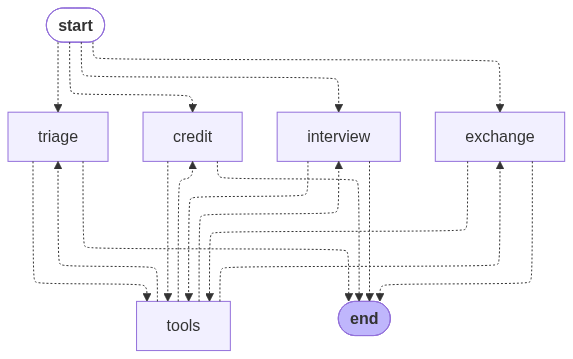

# Banco Ágil -- Atendimento Virtual Multi-Agente

Sistema de atendimento bancário inteligente construído com agentes de IA especializados. Cada agente tem um escopo bem definido, mas o cliente percebe uma única conversa fluida: as transferências entre agentes são implícitas, sem mencionar termos como "redirecionamento" ou "agente".

## Visão Geral

O Banco Ágil é um banco digital fictício cujo atendimento é conduzido por quatro agentes:

- **Triagem** -- Porta de entrada. Autentica o cliente (CPF + data de nascimento contra `clientes.csv`) e identifica a necessidade para encaminhar ao agente correto. Permite até 3 tentativas de autenticação.
- **Crédito** -- Consulta o limite de crédito atual e processa solicitações de aumento, validando contra a tabela `score_limite.csv`. Se o score não for suficiente, oferece a entrevista de crédito.
- **Entrevista de Crédito** -- Conduz uma entrevista financeira estruturada (renda, emprego, despesas, dependentes, dívidas) para recalcular o score do cliente usando uma fórmula ponderada. Atualiza o score em `clientes.csv` e devolve o cliente ao agente de crédito.
- **Câmbio** -- Consulta cotações de moedas em tempo real via AwesomeAPI e apresenta valores de compra, venda, máxima, mínima e variação do dia.

O sistema roda sobre um grafo LangGraph onde cada agente é um nó, conectados por arestas condicionais. Um único estado compartilhado (`AgentState`) carrega o histórico de mensagens, dados do cliente e o agente ativo, permitindo transferências implícitas sem que o cliente perceba a troca.

## Arquitetura



```
src/
  config.py          -- Configuração do LLM e caminhos de dados
  state.py           -- Definição do AgentState (TypedDict compartilhado)
  graph.py           -- Grafo LangGraph: nós, roteamento condicional, tool_node
  agents/
    triage.py        -- Prompt e ferramentas do agente de triagem
    credit.py        -- Prompt e ferramentas do agente de crédito
    interview.py     -- Prompt e ferramentas do agente de entrevista
    exchange.py      -- Prompt e ferramentas do agente de câmbio
  tools/
    auth.py          -- authenticate_client (validação contra CSV)
    credit.py        -- query_credit_limit, request_limit_increase
    interview.py     -- calculate_credit_score, update_client_score
    exchange.py      -- get_exchange_rate (AwesomeAPI)
    routing.py       -- transfer_to_credit, transfer_to_interview,
                        transfer_to_exchange, transfer_to_triage
    common.py        -- end_conversation
data/
  clientes.csv                       -- Base de clientes
  score_limite.csv                   -- Faixas de score e limites máximos
  solicitacoes_aumento_limite.csv    -- Registro de solicitações
tests/
  shared/            -- Testes do grafo, config e ferramentas comuns
  triage/            -- Testes do agente de triagem
  credit/            -- Testes do agente de crédito
  interview/         -- Testes do agente de entrevista
  exchange/          -- Testes do agente de câmbio
app.py               -- Frontend Streamlit
main.py              -- Interface CLI
```

### Fluxo de Handoff

O mecanismo de transferência entre agentes funciona em três camadas:

1. **Ferramentas de transferência** (`routing.py`): cada função como `transfer_to_credit()` simplesmente retorna uma string de confirmação. O LLM decide chamá-las com base no prompt de sistema do agente ativo.

2. **tool_node** (`graph.py`): ao executar uma tool call, verifica se o nome da ferramenta está no `TRANSFER_MAP`. Se estiver, atualiza `current_agent` no estado. Não há lógica condicional complexa -- é um dicionário direto (`"transfer_to_credit" -> "credit"`).

3. **Roteamento condicional**: após o `tool_node`, a função `route_after_tools` lê `current_agent` do estado e roteia para o nó correspondente. Como o estado pode ter sido alterado pela transferência, o próximo nó será o novo agente, não o anterior.

O resultado é que o cliente envia uma mensagem, o agente de triagem decide que é assunto de crédito, chama `transfer_to_credit`, o estado muda, e a próxima resposta vem do agente de crédito -- tudo dentro do mesmo histórico de mensagens, sem quebra de contexto.

### Dados

Os arquivos CSV em `data/` funcionam como uma base de dados simples:

- `clientes.csv`: registros de clientes com CPF, nome, data de nascimento, limite de crédito e score.
- `score_limite.csv`: tabela de faixas (score mínimo/máximo e limite máximo permitido).
- `solicitacoes_aumento_limite.csv`: log de todas as solicitações de aumento (CPF, timestamp, limite atual, novo limite, status).

As ferramentas de crédito e entrevista leem e escrevem diretamente nesses arquivos.

## Funcionalidades

- Autenticação por CPF e data de nascimento com até 3 tentativas
- Consulta de limite de crédito
- Solicitação de aumento de limite com validação automática por score
- Entrevista financeira estruturada com recálculo de score (fórmula ponderada)
- Consulta de cotação de moedas em tempo real (USD, EUR, GBP, BTC, entre outras)
- Transferência implícita entre agentes (o cliente não percebe a troca)
- Tratamento de erros de sistema com mensagens amigáveis (falha de arquivo, API indisponível, entrada inválida)
- Encerramento de conversa a qualquer momento
- Observabilidade via LangSmith (tracing de cada nó e tool call)

## Stack e Justificativas

**Python** -- Linguagem padrão para aplicações de IA/LLM, com ecossistema maduro de bibliotecas para orquestração de agentes.

**LangGraph** -- Framework de orquestração de agentes baseado em grafos de estado. Escolhido por permitir modelar cada agente como um nó independente com roteamento condicional, o que encaixa diretamente no problema de handoff implícito. Diferente de abordagens sequenciais (como chains simples), o grafo permite ciclos (agente -> ferramenta -> agente) e transferências dinâmicas sem recriar o fluxo.

**LangChain** -- Fornece as abstrações de mensagens (`HumanMessage`, `AIMessage`, `ToolMessage`), o protocolo de ferramentas (`@tool`) e a integração com provedores de LLM (`ChatGoogleGenerativeAI`). Funciona como a camada de interface entre o LangGraph e o modelo.

**Gemini 2.5 Flash (Google)** -- LLM principal do projeto. Free tier com 1.500 requisições/dia. Escolhido por ser a opção com melhor custo-benefício no free tier dentre as alternativas (Groq tinha limite de 100K tokens/dia, que se esgotava em poucas conversas). O projeto também rodou com Groq (LLaMA 3.3 70B) durante o desenvolvimento, reforçando a proposta de ser agnóstico quanto ao modelo.

**AwesomeAPI** -- API pública e gratuita de cotação de moedas. Não exige autenticação, retorna dados em JSON simples. Alternativa prática a APIs que exigem cadastro ou chave.

**Streamlit** -- Framework para construção rápida de interfaces web em Python. Usado para criar a UI de chat do atendimento virtual.

**LangSmith** -- Plataforma de observabilidade da LangChain. Configurado para rastrear cada invocação do grafo, incluindo chamadas ao LLM, execução de ferramentas e transferências entre agentes.

## Desafios Enfrentados

**Modelar o handoff com LangGraph.** O principal desafio foi projetar como os agentes se transferem controle sem que o cliente perceba. A solução foi usar o campo `current_agent` no estado compartilhado: ferramentas de transferência atualizam esse campo, e o roteamento condicional (`route_after_tools`) consulta ele para decidir qual nó executa a seguir. Essa abordagem é simples e extensível -- adicionar um novo agente requer apenas um novo nó, um prompt e uma entrada no `TRANSFER_MAP`.

**Manter cobertura de testes alta.** O projeto tem 130 testes com 100% de cobertura. O desafio foi testar o grafo e as ferramentas sem depender do LLM real. Toda chamada ao LLM nos testes é mockada, simulando respostas com e sem tool calls. Os testes são organizados por agente (`tests/triage/`, `tests/credit/`, etc.) para refletir a separação do código.

**Agnosticismo de modelo.** O projeto foi construído para trocar de provedor de LLM com o mínimo de atrito. Toda a configuração de modelo fica isolada em `config.py`, que expõe uma única função `get_llm()`. Durante o desenvolvimento, o projeto migrou de Groq (LLaMA 3.3 70B) para Gemini 2.5 Flash, o que exigiu apenas alterar o import e o construtor em um único arquivo -- nenhum outro módulo precisou mudar. O objetivo foi manter essa flexibilidade sem criar camadas excessivas de abstração.

**Documentar o fluxo de handoff.** Explicar como as transferências implícitas funcionam não é trivial porque o mecanismo envolve três camadas (ferramenta, tool_node, roteamento). A documentação no código usa docstrings objetivas, e a seção de arquitetura deste README detalha o fluxo passo a passo.

## Possíveis Melhorias

- **Trocar CSV por banco de dados.** A persistência atual em arquivos CSV é simples mas frágil (sem concorrência, sem transações). Um banco como MongoDB seria mais adequado para armazenar dados de clientes e solicitações, especialmente se o sistema precisar escalar.

- **Adicionar RAG para consulta de normas.** Se o banco precisar responder perguntas sobre regulamentos, políticas internas ou contratos, o ideal seria indexar esses documentos com embeddings em um banco vetorial como ChromaDB e usar RAG (Retrieval-Augmented Generation) para que os agentes consultem a base de conhecimento antes de responder.

- **Retry automático com backoff.** Hoje, se o LLM retorna erro de rate limit, o agente devolve uma mensagem de desculpas. Uma melhoria seria implementar retry com backoff exponencial para tornar a experiência mais transparente ao cliente.

- **Streaming de respostas.** Atualmente a resposta do LLM só aparece depois de completa. Usar streaming permitiria mostrar a resposta token a token na interface, melhorando a percepção de velocidade.

## Tutorial de Execução

### Pré-requisitos

- Python 3.12+
- Chave de API do Gemini ([Google AI Studio](https://aistudio.google.com/apikey))

### Instalação

```bash
git clone https://github.com/gabrafo/bank-multi-agent.git
cd bank-multi-agent
python -m venv .venv
source .venv/bin/activate
pip install -r requirements.txt
```

### Configuracao

Crie um arquivo `.env` na raiz do projeto:

```dotenv
LLM_API_KEY="sua-chave-gemini"
LLM_MODEL_NAME="gemini-2.5-flash"
```

Para habilitar observabilidade com LangSmith (opcional):

```dotenv
LANGSMITH_API_KEY="sua-chave-langsmith"
LANGSMITH_TRACING=true
LANGSMITH_ENDPOINT=https://api.smith.langchain.com
LANGSMITH_PROJECT="bank-multi-agent"
```

### Executando

**Interface web (Streamlit):**

```bash
.venv/bin/python -m streamlit run app.py
```

### Testes

```bash
.venv/bin/python -m pytest tests/ --cov=src --cov-report=term-missing
```

Resultado esperado: 130 testes passando, 100% de cobertura.
